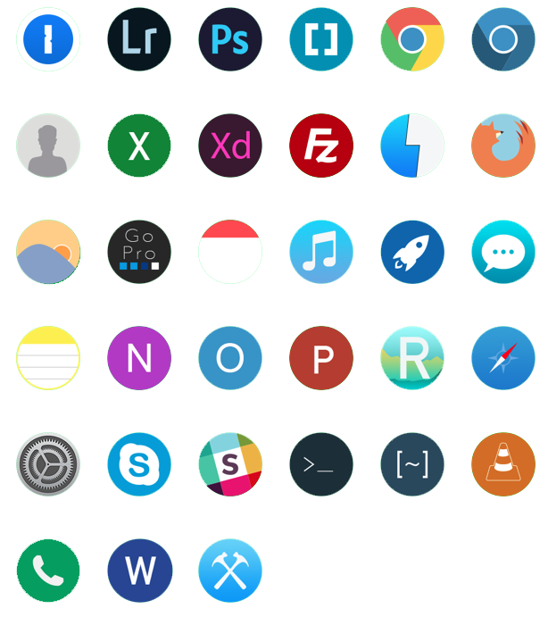

## About
New circular app icons for some Mac applications

## Contribution
Contribution is welcome

This folder has some files to help you build your own App icons if you want.
[This](https://blog.macsales.com/28492-create-your-own-custom-icons-in-10-7-5-or-later) website has a good tutorial for making an icon if you want to do it on your own.
If you want to follow my process, which has some tools I wrote to make it easier, please read **everything** in the building section. 
There are some things in the tools that I wrote that if you do not use them right, they may delete things on your computer with no chance for recovery.

### Photoshop

If you have photoshop, open the templates folder. 
There are three different templates, and you may use whichever one you want to create your new app. 
Here is an example photoshop icon made with a circle, square and squrcle.

  

Draw whatever you like, but **make sure that you use only vectors** (the pen tool).
If you draw anything with pixels, it will look really gross when it downscales and then scales back up again.
Import the photoshop actions script in this folder.
This action will auto resize and export the app to the desktop with all the proper names and sizes needed.

### Building
When you have all the image sizes on the desktop, you can use the iconbuilder tool to convert it into an icon.

**NOTE:** if you have any other png's on your desktop, running the script will delete them with no recovery.

Open up a terminal, and run the **iconbuilder.sh** script.
It will ask you for the name of the app, and its best you don't put any spaces in your app icon name.
It will package it all up and give you an icon.
If you want to rename it, you can after it is done.

### Installation
When you have an app you want to replace with the original one:

1. Find the application in your application folder
2. Right click on the application
3. Press *more info* on the dropdown menu
4. Drag your new icon into the current icon in the top left corner of the info box that popped up
