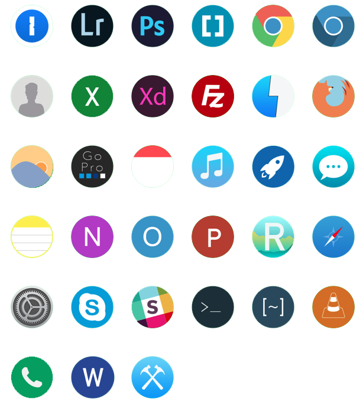

## About
New circular app icons for some Mac applications

## Contribution
Contribution is welcome

This folder has some files to help you build your own App icons if you want.
[This](https://blog.macsales.com/28492-create-your-own-custom-icons-in-10-7-5-or-later) website has a good tutorial for making an icon.

### Photoshop

If you have photoshop, open the **Circle Icon Template.psd**. 
All the icons here are going to be the circular, but you can do whatever you want for yourself.
Draw whatever you like, but **make sure that you use only vectors** (the pen tool).
If you draw anything with pixels, it will look really gross when it downscales and then scales back up again.
Import the photoshop actions script in this folder.
This action will auto resize and export the app to the desktop with all the proper names and sizes needed.
Use the **iconbuilder.sh** script to turn it into an icon.

