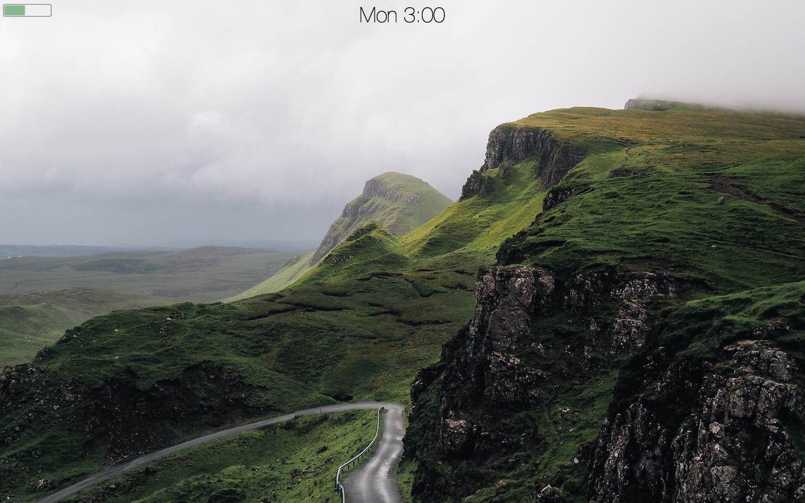
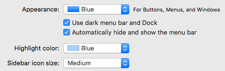

## Demo

A demo of some of the code in action

## Screenshots

The desktop without the dock

## Interface

I did a few preference changes to the operating system to hide away most of the icons and buttons. This makes for a minimal setup that keeps away distracting information.

In the **General** tab of the System Preferences, I checked the boxes that

1. Use dark menu bar and Dock
1. Automatically hide and show the menu bar

In the **Dock** tab of the System Preferences, I checked the box near the bottom that says *Automatically hide and show the Dock*

## Structure

This project contains several standalone things that you can install selectively if you like.

The folders are as such

* UI: Adds the clock and battery icons, and changes the background image and color scheme
	* dark-light: The code that controlls the environment dark/light color schemes
	* ubersicht: The files that load the clock and battery on the desktop using the app [ubersicht](http://tracesof.net/uebersicht/)
* window_manager: the configuration files for [hammerspoon](http://www.hammerspoon.org/) that allow for window placement through keyboard shortcuts 
* dateStampChanger.sh: A bash script for changing the created time on a file
* connor.h: Some helpful C++ functions
* bash_profile: My bash profile that adds some cool shortcuts for terminal usage
* zshrc: My zsh profile that adds some cool shortcuts for terminal usage
