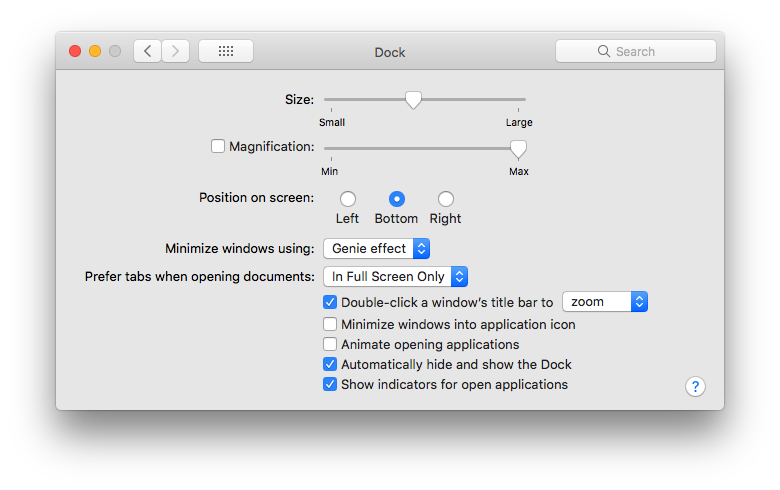

# Extension Scripts

## Demo

A demo of some of the code in action

## Screenshots

The desktop without the dock

## Getting set up

### Installing

1. Have a computer running macOS
1. `./install.sh`
1. Verify `npm` was installed correctly
1. `npm install --global npm-check-updates changelog git-file-history tldr`

The install script will

1. Install homebrew if your computer does not already have it
1. Install helpful applications and CLI tools using homebrew
1. Set up your zsh config

### Interface

I did a few preference changes to the operating system to hide away most of the icons and buttons. This makes for a minimal setup that keeps away distracting information.

In the **General** tab of the System Preferences, I checked the boxes that

1. Use dark menu bar and Dock
1. Automatically hide and show the menu bar

In the **Dock** tab of the System Preferences, I checked the box near the bottom that says *Automatically hide and show the Dock*

## NPM projects to install globally

* [npm-check-updates](https://www.npmjs.com/package/npm-check-updates)
* [changelog](https://www.npmjs.com/package/changelog)
* [git-file-history](https://www.npmjs.com/package/git-file-history)
* [tldr](https://www.npmjs.com/package/tldr)

## Structure

This project contains several standalone things that you can install selectively if you like.

The folders are as such

* UI: Adds the clock and battery icons, and changes the background image and color scheme
  * dark-light: The code that controls the environment dark/light color schemes
  * ubersicht: The files that load the clock and battery on the desktop using the app [ubersicht](http://tracesof.net/uebersicht/)

* window_manager: the configuration files for [hammerspoon](http://www.hammerspoon.org/) that allow for window placement through keyboard shortcuts
* dateStampChanger.sh: A bash script for changing the created time on a file
* connor.h: Some helpful C++ functions
* command_line: Configuration that adds some cool shortcuts for terminal usage. macOS defaults to zsh, so if you don't know which to use, it is probably zsh.
* install.sh: A script that installs the command line tools along with helpful software.

## Projects

Cool projects I would like to steal ideas from:

* [andyshirt/MacOS-Dotfiles](https://github.com/atidyshirt/MacOS-Dotfiles)
* [frewacom/Pywalfox](https://github.com/Frewacom/Pywalfox)

## Git configuration

* `git config --global core.editor "code --wait --new-window"` - Use vsCode as the default editor
